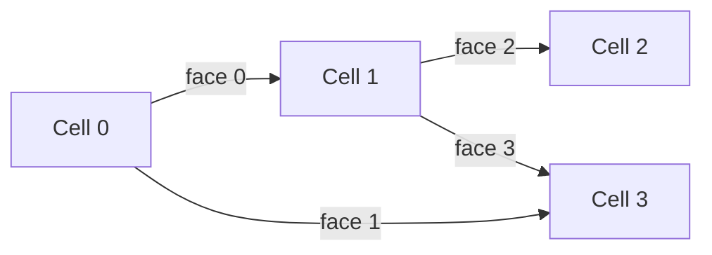

# Geometry

How mod-PATH3DU represents and uses unstructured grid geometry.

## Unstructured Grids

mod-PATH3DU operates on **MODFLOW-USG unstructured grids**, where cells can be arbitrary convex polygons in plan view with a vertical extent defined by top and bottom elevations. Unlike structured grids (MODFLOW-2005), unstructured grids allow:

- Variable cell shapes and sizes (triangles, quadrilaterals, general polygons)
- Local refinement without global remeshing
- Flexible connectivity between cells

Each cell is defined by:

- A set of **vertices** — ordered $(x, y)$ coordinates forming the cell polygon
- A **centroid** — $(x, y, z)$ center used for interpolation
- **Top and bottom elevations** — defining the 3D extent

## Cell Geometry

Cells are loaded into a `GridHandle` via `build_grid()`. The function accepts:

- `vertices`: a list of cells, where each cell is a list of $(x, y)$ vertex coordinate pairs
- `centers`: a list of $(x, y, z)$ centroid coordinates

From these inputs, the grid computes derived geometric quantities needed for velocity interpolation:

| Quantity | Description |
|----------|-------------|
| Cell area | Plan-view polygon area |
| Cell perimeter | Boundary length of the polygon |
| Cell radius | Effective radius ($\sqrt{A / \pi}$) |
| Face lengths | Length of each shared face between neighbors |
| Face midpoint velocities | Interpolated from flow data across each face |

## Face Connectivity

Cell-to-cell relationships are represented using a **Compressed Sparse Row (CSR)** data structure:

- `face_offset[i]` to `face_offset[i+1]` gives the range of neighbors for cell $i$
- `face_neighbor[j]` gives the neighbor cell ID for connection $j$
- `face_flow[j]` gives the volumetric flow rate across connection $j$



!!! info "Array indexing"
    All cell and face indices are **0-based**. See [Units & Conventions](../reference/units-and-conventions.md#array-ordering) for the full indexing specification.

## The Waterloo Method

The **Waterloo velocity interpolation method** constructs a continuous, divergence-honouring velocity field within each cell. Unlike simple linear interpolation between cell centers, the Waterloo method:

1. **Fits a polynomial velocity field** inside each cell using face flow data and cell geometry
2. **Preserves mass balance** — the interpolated velocity field satisfies the continuity equation within each cell
3. **Provides smooth velocity gradients** — critical for accurate particle tracking and dispersion calculations

### How It Works

!!! tip "Performance feature: on-demand cell setup"
    mod-PATH3DU does **not** do the full Waterloo cell setup everywhere before tracking starts.
    It prepares the field, then finishes the heavier per-cell work only when a particle
    actually needs velocity in that cell. In practice, this means you only pay the full
    setup cost for cells that particles actually visit.

For each cell, the method:

1. Computes face midpoint velocities from the face flow rates and face geometry
2. Constructs a local polynomial approximation of order $n$ (controlled by `WaterlooConfig.order_of_approx`) using $m$ control points (`WaterlooConfig.n_control_points`)
3. Solves a least-squares system to determine polynomial coefficients that honour the face fluxes
4. The resulting velocity field $\mathbf{V}(x, y, z)$ is continuous within the cell and consistent with the specified flows at each face

### Configuration

The Waterloo method is configured via `WaterlooConfig`:

```python
import mp3du

config = mp3du.WaterlooConfig(
    order_of_approx=35,    # polynomial order for velocity fitting
    n_control_points=122,  # number of control points per cell
)
```

Higher values produce more accurate fits but increase computation time. The defaults (35, 122) are well-tested for most applications.

### Fitting the Field

After loading the grid, cell properties, cell flows, and Waterloo-specific inputs, the field is fitted:

```python
field = mp3du.fit_waterloo(config, grid, waterloo_inputs, cell_props, cell_flows)
```

The returned `WaterlooFieldHandle` can then evaluate velocity at any point within the grid domain.

## Coordinate Systems

mod-PATH3DU uses a **right-handed Cartesian coordinate system**:

| Axis | Direction | Typical convention |
|------|-----------|--------------------|
| $X$ | East | Easting |
| $Y$ | North | Northing |
| $Z$ | Up | Elevation |

All spatial inputs (vertices, centroids, heads, elevations) must use consistent units. There is no built-in unit conversion — if your model uses metres, all coordinates and hydraulic parameters must be in metres.

See [Units & Conventions](../reference/units-and-conventions.md) for the complete specification of coordinate systems, sign conventions, and array ordering.
