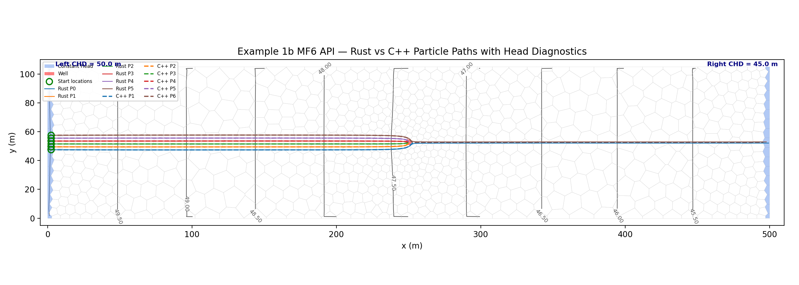

# MODFLOW 6 API Integration

This example demonstrates how to couple `mp3du-rs` with a running MODFLOW 6 simulation using the `modflowapi`. It extracts geometry, heads, and flows directly from memory without reading binary output files.

This is a complete, working example based on the "Example 1b" Voronoi grid model.

## Output



The plot shows the Voronoi grid, constant head boundaries (blue), the pumping well (red), and the particle trajectories tracked by `mp3du-rs` using the Waterloo velocity interpolation method.

## Key Concepts for LLMs and Developers

1. **FLOW-JA-FACE Sign Convention**: MODFLOW 6 `FLOWJA` uses positive = INTO cell. The `mp3du-rs` API also uses positive = INTO cell. Therefore, you pass the `FLOWJA` array directly to both `hydrate_cell_flows` and `hydrate_waterloo_inputs` without any negation.
2. **Extracting Boundary Flows via API**: When reading boundary condition flows (like CHD) via the MF6 API, do NOT use the `RHS` array. The `RHS` array contains the right-hand side of the matrix equation, not the actual computed flow rate. Instead, use the `SIMVALS` array, which contains the computed flow rates for the boundary condition after the time step is solved.
3. **Domain Boundaries vs. IFACE Capture**: Do NOT mark cells as domain boundaries (`is_domain_boundary_arr = True`) if particles need to start inside them or pass through them. Particles entering a domain boundary cell are immediately terminated with `CapturedAtModelEdge`. Instead, rely on IFACE-based capture (e.g., IFACE=2 for lateral CHD flow) which allows particles to exist within the cell and only captures them when they exit the appropriate face.

## Workflow

1.  **Create Model**: Build a steady-state MF6 DISV model from the original Voronoi geometry.
2.  **Initialize API**: Initialize MODFLOW 6 through the shared-library API.
3.  **Extract Data**: Read heads, FLOW-JA-FACE, and package rates directly from MF6 memory.
4.  **Hydrate mp3du**: Build `mp3du.hydrate_cell_flows()` and `mp3du.hydrate_waterloo_inputs()`.
5.  **Fit Velocity Field**: Fit the Waterloo velocity field with `mp3du.fit_waterloo()`.
6.  **Track Particles**: Track particles with `mp3du.run_simulation()`.

## Scripts

### 1. Model Creation (`create_model.py`)

This script builds the MODFLOW 6 DISV model using `flopy`. It reads the Voronoi geometry from a GSF file and sets up the CHD and WEL packages.

```python
--8<-- "docs/examples/mf6_api_create_model.py"
```

### 2. Tracking Execution (`run_tracking.py`)

This script runs the MODFLOW 6 simulation via the API, extracts the necessary data, and runs the `mp3du-rs` particle tracking.

```python
--8<-- "docs/examples/mf6_api_run_tracking.py"
```

## See Also

- [Units & Conventions](../reference/units-and-conventions.md)
- [IFACE Flow Routing](../reference/iface-flow-routing.md)
- [Single-Cell Diagnostic](single-cell-diagnostic.md)
