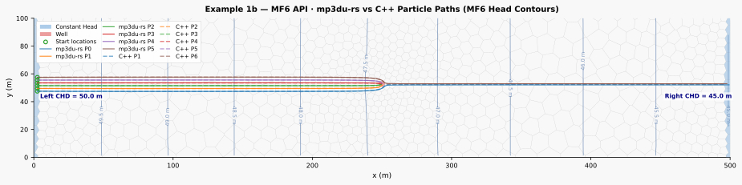

# MODFLOW 6 API Integration — Example 1b (Modern Update)

> **Modern Update**: This example replaces the classic file-based [Example 1b](https://mp3du.sspa.com/man/#Examples) from the original mod-PATH3DU distribution with a fully API-driven workflow. No binary file I/O required.

## What Makes This Modern

The original Example 1b relied on a chain of file-based operations: write MF6 input files, run the MF6 executable, read binary `.HDS`/`.CBB` outputs, then invoke the C++ particle tracker. This update eliminates every intermediate file by coupling three Python APIs directly in memory.

| Component | API | What It Replaces |
|-----------|-----|------------------|
| **MODFLOW 6** | `modflowapi` (shared library) | Reading `.HDS`, `.CBB` binary files |
| **MP3DU-RS** | `mp3du` Python bindings | C++ executable with file-based I/O |
| **FloPy** | `flopy` | Manual text file editing |

### Key Improvements Over the Original

| Original Approach | Modern API Approach |
|-------------------|---------------------|
| Read legacy boundary-condition files to define BCs | Use exact CHD cell IDs from the original Example 1b setup |
| Run MF6 executable → read `.HDS`/`.CBB` binary | Solve via `modflowapi` → extract heads/flows from memory |
| Invoke C++ `mp3du` executable | Call `mp3du.run_simulation()` directly from Python |
| Multiple disk I/O operations | Zero intermediate files |
| Batch processing only | Real-time coupling possible |

## Output



The plot shows the Voronoi grid, MF6 head contours, constant head boundaries (blue), the pumping well (red), particle start locations, and a comparison between `mp3du-rs` pathlines (solid) and legacy C++ pathlines (dashed).

## Model Description

This example uses the same conceptual model as the original Example 1b:

- **Grid**: Voronoi DISV (~400 cells, single layer)
- **Domain**: 500 m × 100 m × 50 m
- **Hydraulic conductivity**: K = 10 m/d, K33 = 1 m/d
- **Porosity**: 0.30
- **Boundary conditions**:
    - Left boundary: Constant head = 50 m
    - Right boundary: Constant head = 45 m
    - One pumping well: Q = −50 m³/d (cell 361)

## Key Concepts for LLMs and Developers

### 1. FLOW-JA-FACE Sign Convention

MODFLOW 6 `FLOWJA` uses **positive = INTO cell**. The `mp3du-rs` API also uses **positive = INTO cell**. Pass the `FLOWJA` array directly to both [`hydrate_cell_flows()`](../reference/python-api/functions.md) and [`hydrate_waterloo_inputs()`](../reference/python-api/functions.md) without any negation.

### 2. Extracting Boundary Flows via API

When reading boundary condition flows (like CHD) via the MF6 API, use `SIMVALS` (computed flow rates), **not** `RHS` (matrix right-hand side). The `RHS` array contains the right-hand side of the matrix equation, not the actual computed flow rate.

```python
# Correct: use SIMVALS after mf6.update()
simvals = mf6.get_value("GWF/CHD_0/SIMVALS").copy()

# Wrong: RHS is not the flow rate
# rhs = mf6.get_value("GWF/CHD_0/RHS").copy()
```

### 3. IFACE-Based Capture for CHD Cells

Do **not** mark CHD cells as domain boundaries (`is_domain_boundary_arr = True`). Particles entering a domain boundary cell are immediately terminated with `CapturedAtModelEdge`. Instead, use IFACE=2 for lateral CHD flow, which allows particles to exist within the cell and only captures them when they exit through the appropriate face.

```python
# CHD cells: IFACE=2 (lateral boundary capture)
bc_iface_list.append(2)

# Well cells: IFACE=0 (point sink capture)
bc_iface_list.append(0)
```

### 4. Exact Boundary Mapping from the Original Example

The updated [`create_model.py`](mf6_api_create_model.py) does not use heuristic boundary detection. Instead, it preserves the original Example 1b boundary-condition layout by hardcoding the exact left and right CHD cell IDs that correspond to the original Voronoi setup.

This keeps the modern API workflow self-contained while still reproducing the intended capture behavior and pathline geometry from the legacy example.

## Workflow

```
create_model.py                    run_tracking.py
──────────────────────────         ──────────────────────────────────────────
1. Parse mp3du.gsf geometry   →    1. Load grid_meta.json + cell_polygons.json
2. Apply exact CHD/WEL mapping      2. Initialize MF6 via modflowapi
3. Build MF6 DISV model via        3. mf6.update() → solve steady-state flow
   FloPy (no text file editing)    4. Extract heads + FLOWJA from memory
4. Write sim/ + grid_meta.json     5. Read WEL/CHD SIMVALS from memory
   + cell_polygons.json            6. Build mp3du grid + hydrate flows
                                   7. fit_waterloo() → velocity field
                                   8. run_simulation() → particle paths
                                   9. Save trajectories.csv + capture_summary.csv + particle_paths.svg
```

## Requirements

```bash
pip install flopy modflowapi pyshp matplotlib mp3du
```

You also need the MODFLOW 6 shared library (`libmf6.dll` on Windows, `libmf6.so` on Linux):

```bash
python -m flopy.utils.get_modflow /path/to/mf6api --repo modflow6
```

Set the `LIBMF6_PATH` environment variable or place the library in `%TEMP%/mf6api/`.

## Usage

```bash
# Step 1: Create the MF6 model (writes to sim/ folder)
python create_model.py

# Step 2: Run flow + tracking via API
python run_tracking.py
```

## Scripts

### 1. Model Creation (`create_model.py`)

Builds the MODFLOW 6 DISV model using `flopy`. Reads the Voronoi geometry from the GSF file and applies the original Example 1b boundary-condition mapping using exact CHD cell IDs plus the original pumping well location.

```python
--8<-- "docs/examples/mf6_api_create_model.py"
```

### 2. Tracking Execution (`run_tracking.py`)

Runs the MODFLOW 6 simulation via the shared-library API, extracts heads and flows directly from memory, and runs `mp3du-rs` particle tracking. The script also writes a capture summary and generates an SVG comparison figure against the legacy C++ pathlines.

```python
--8<-- "docs/examples/mf6_api_run_tracking.py"
```

## Outputs

| Output | Description |
|--------|-------------|
| `trajectories.csv` | Full particle trajectory data (x, y, z, time, cell_id per step) |
| `capture_summary.csv` | Final status and capture location for each particle |
| `particle_paths.svg` | Visualization with MF6 head contours, start points, and `mp3du-rs` vs legacy C++ pathlines |

## Technical Notes

### MF6 Memory Address Reference

| Variable | MF6 Address | Description |
|----------|-------------|-------------|
| Heads | `GWF/X` | Hydraulic head per cell |
| Cell-to-cell flows | `GWF/FLOWJA` | Compressed sparse row flow array |
| Connectivity (row ptr) | `GWF/CON/IA` | CSR row pointer (1-based) |
| Connectivity (col idx) | `GWF/CON/JA` | CSR column indices (1-based) |
| CHD flow rates | `GWF/CHD_0/SIMVALS` | Computed BC flow rates (use this, not RHS) |
| CHD node list | `GWF/CHD_0/NODELIST` | 1-based cell indices for CHD cells |
| WEL pumping rates | `GWF/WEL_0/Q` | Pumping rates per well |
| WEL node list | `GWF/WEL_0/NODELIST` | 1-based cell indices for well cells |

### Transient Extension

The same pattern extends to transient simulations. Instead of calling `mf6.update()` once, loop over stress periods and call `mp3du.run_simulation()` after each solve to track particles through time-varying flow fields.

## See Also

- [Units & Conventions](../reference/units-and-conventions.md)
- [IFACE Flow Routing](../reference/iface-flow-routing.md)
- [Single-Cell Diagnostic](single-cell-diagnostic.md)
- [Original Example 1b](https://mp3du.sspa.com/man/#Examples) (file-based version)
- [MODFLOW 6 API Documentation](https://modflow6.readthedocs.io/)
