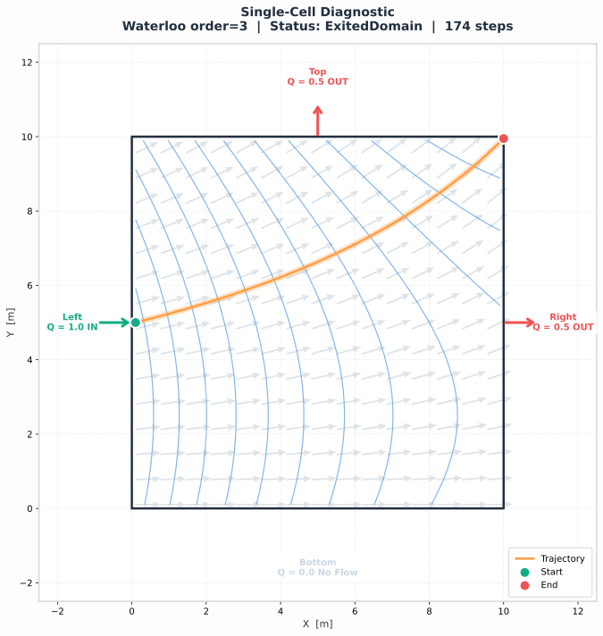

# Single-Cell Diagnostic

A visual sanity-check that builds **one** rectangular cell with known face
flows, fits a Waterloo velocity field, tracks a particle, and plots
everything together.  Use it to verify that:

- face-flow signs and directions are consistent,
- the interpolated velocity field is physically reasonable,
- the particle trajectory follows the expected streamline.

This script is designed as a **self-contained diagnostic** that AI agents
can run immediately to validate their understanding of mp3du conventions
before attempting a full model integration.

## Output



| Item | Value |
|------|-------|
| **Status** | `ExitedDomain` |
| **Steps** | 174 |
| **Start** | (0.1, 5.0) |
| **End** | (10.0, 9.95) |

The particle enters through the left face (green arrow, Q = 1.0 m³/d IN),
flows right and upward following the velocity field, and exits the domain
near the top-right corner — exactly what the face-flow budget predicts
(0.5 m³/d out the right face, 0.5 m³/d out the top face).

## Script

```python
import json
from pathlib import Path

import matplotlib.pyplot as plt
import numpy as np

import mp3du

print(f"mp3du {mp3du.version()}")

# ╔══════════════════════════════════════════════════════════════════════╗
# ║  Configuration — edit these to explore different scenarios          ║
# ╚══════════════════════════════════════════════════════════════════════╝

CELL_SIZE = 10.0          # m — square cell side length
TOP, BOT = 10.0, 0.0      # m — cell top / bottom elevation
POROSITY = 0.25            # dimensionless
HHK = 1e-2                 # m/d — horizontal hydraulic conductivity
VHK = 1e-3                 # m/d — vertical hydraulic conductivity
CENTER_HEAD = 9.0          # m — hydraulic head at cell centre

# Physical flow budget  (positive = INTO the cell)
#   Faces are ordered by CW vertex index: Left(0), Top(1), Right(2), Bottom(3)
Q_LEFT = 1.0               # m³/d — 1.0 IN  (positive = into cell)
Q_TOP = -0.5              # m³/d — 0.5 OUT (negative = out of cell)
Q_RIGHT = -0.5             # m³/d — 0.5 OUT (negative = out of cell)
Q_BOTTOM = 0.0             # m³/d — no flow through bottom face

# Particle start (x, y are physical coordinates; z is LOCAL [0, 1])
PX, PY, PZ = 0.1, 5.0, 0.5

# Waterloo fitting parameters
ORDER_OF_APPROX = 3
N_CONTROL_POINTS = 16


# ── Step 1: Grid (CW winding required) ─────────────────────────────────────────
#   v0=(0,0) → v1=(0,L) → v2=(L,L) → v3=(L,0)
#   Gives faces: 0=left, 1=top, 2=right, 3=bottom

L = CELL_SIZE
vertices = [[(0.0, 0.0), (0.0, L), (L, L), (L, 0.0)]]
centers = [(L / 2, L / 2, (TOP + BOT) / 2)]
grid = mp3du.build_grid(vertices, centers)

# ── Step 2: Cell properties ──────────────────────────────────────────

cell_props = mp3du.hydrate_cell_properties(
    top=np.array([TOP]),
    bot=np.array([BOT]),
    porosity=np.array([POROSITY]),
    retardation=np.array([1.0]),
    hhk=np.array([HHK]),
    vhk=np.array([VHK]),
    disp_long=np.array([0.0]),
    disp_trans_h=np.array([0.0]),
    disp_trans_v=np.array([0.0]),
)

# ── Step 3: Face flows ───────────────────────────────────────────────
# Convention: positive = INTO cell, negative = OUT of cell.
# The SAME face_flow array is passed to both hydrate_cell_flows()
# and hydrate_waterloo_inputs().
#
# Budget: 1.0 IN (left) = 0.5 OUT (right) + 0.5 OUT (top)
# Face order follows CW vertex order: Left(0), Top(1), Right(2), Bottom(3)

face_flow = np.array([Q_LEFT, Q_TOP, Q_RIGHT, Q_BOTTOM], dtype=np.float64)
assert abs(face_flow.sum()) < 1e-12, "Flow budget not balanced"

face_offset = np.array([0, 4], dtype=np.uint64)
face_neighbor = np.array([-1, -1, -1, -1], dtype=np.int64)  # all boundary

# ── Step 4: Hydrate cell flows ───────────────────────────────────────
# water_table rule: confined → top, unconfined → head, convertible → min(head, top)

cell_flows = mp3du.hydrate_cell_flows(
    head=np.array([CENTER_HEAD]),
    water_table=np.array([TOP]),
    q_top=np.zeros(1), q_bot=np.zeros(1), q_vert=np.zeros(1),
    q_well=np.zeros(1), q_other=np.zeros(1), q_storage=np.zeros(1),
    has_well=np.zeros(1, dtype=bool),
    face_offset=face_offset,
    face_flow=face_flow,               # ← positive = INTO
    face_neighbor=face_neighbor,
)

# ── Step 5: Hydrate Waterloo inputs ──────────────────────────────────

waterloo_inputs = mp3du.hydrate_waterloo_inputs(
    centers_xy=np.array([[L / 2, L / 2]]),
    radii=np.array([L / 2]),
    perimeters=np.array([4 * L]),
    areas=np.array([L * L]),
    q_vert=np.zeros(1), q_well=np.zeros(1), q_other=np.zeros(1),
    face_offset=face_offset,
    face_vx1=np.array([0.0, 0.0, L, L]),
    face_vy1=np.array([0.0, L,   L, 0.0]),
    face_vx2=np.array([0.0, L,   L, 0.0]),
    face_vy2=np.array([L,   L,   0.0, 0.0]),
    face_length=np.array([L, L, L, L]),
    face_flow=face_flow,               # ← same array, positive = INTO
    noflow_mask=np.zeros(4, dtype=bool),
)

# ── Step 6: Fit Waterloo velocity field ──────────────────────────────

waterloo_cfg = mp3du.WaterlooConfig(
    order_of_approx=ORDER_OF_APPROX,
    n_control_points=N_CONTROL_POINTS,
)
field = mp3du.fit_waterloo(waterloo_cfg, grid, waterloo_inputs, cell_props, cell_flows)

# ── Step 7: Simulation configuration ─────────────────────────────────
# direction: 1.0 = forward, -1.0 = backward (only valid values)

config = mp3du.SimulationConfig.from_json(json.dumps({
    "velocity_method": "Waterloo",
    "solver": "DormandPrince",
    "direction": 1.0,
    "initial_dt": 0.5,
    "max_dt": 2.0,
    "retardation_enabled": False,
    "adaptive": {
        "tolerance": 1e-6, "safety": 0.9, "alpha": 0.2,
        "min_scale": 0.2, "max_scale": 5.0, "max_rejects": 10,
        "min_dt": 1e-10, "euler_dt": 0.1,
    },
    "dispersion": {"method": "None"},
    "capture": {
        "max_time": 500.0, "max_steps": 1000,
        "stagnation_velocity": 1e-12, "stagnation_limit": 10,
    },
}))

# ── Step 8: Track one particle ───────────────────────────────────────
# z is LOCAL [0, 1]:  0.5 = mid-layer.  NOT a physical elevation!

particles = [
    mp3du.ParticleStart(id=0, x=PX, y=PY, z=PZ, cell_id=0, initial_dt=0.5),
]
results = mp3du.run_simulation(config, field, particles, parallel=False)
result = results[0]
records = result.to_records()

print(f"Status : {result.final_status}")
print(f"Steps  : {len(records)}")
if records:
    print(f"Start  : ({records[0]['x']:.4f}, {records[0]['y']:.4f})")
    print(f"End    : ({records[-1]['x']:.4f}, {records[-1]['y']:.4f})")
```

The plotting section (Step 9–10) samples the velocity field on a 20 × 20 grid,
approximates head contours via Darcy's law, and draws the trajectory.  See the
[full script](single_cell_diagnostic.py) for the complete matplotlib code.

## What Each Layer Shows

| Layer | Description |
|-------|-------------|
| **Black rectangle** | Cell boundary (10 × 10 m) |
| **Labelled arrows** | Face flows — green = inflow, red = outflow, with magnitude |
| **Blue contours** | Approximate head field derived from the fitted velocities |
| **Grey quiver arrows** | Waterloo interpolated velocity field (unit vectors, 20 × 20) |
| **Orange line** | Particle trajectory (174 steps, Dormand–Prince adaptive solver) |
| **Green / red dots** | Start (0.1, 5.0) and end (10.0, 9.95) positions |

## Key Conventions Demonstrated

1. **CW winding** — vertices are listed clockwise; this is required
   by the Waterloo method.
   (If your source uses CCW winding, reverse the vertex list and negate all `face_flow` values.)
2. **z is local [0, 1]** — the particle starts at `z=0.5` (mid-layer), not a
   physical elevation.
3. **Face order matches vertex order** — vertex pair (0→1) defines face 0
   (Left), (1→2) defines face 1 (Top), etc.
4. **face_flow: positive = INTO** — the same array (positive = into cell) is
   passed to both `hydrate_cell_flows()` and `hydrate_waterloo_inputs()`.
5. **Low-order Waterloo fit** — `order_of_approx=3` with 16 control points
   works well for a simple rectangular cell with smooth flow.
6. **Mass conservation** — the script asserts that face flows sum to zero
   before running.

## Adapting for Real MODFLOW Data

When loading actual MODFLOW output instead of synthetic flows:

```python
# MODFLOW-USG / MF6 (FLOW-JA-FACE):  raw positive = INTO cell
#   → pass directly
face_flow = flowja_values

# MODFLOW-2005 / NWT (after directional → per-face assembly):
#   → positive = OUT → negate once
face_flow = -assembled_face_flow

# In BOTH cases, pass the same face_flow to both hydrate functions.
```

See [Units & Conventions](../reference/units-and-conventions.md) for the full
sign-convention reference.

## See Also

- [Units & Conventions](../reference/units-and-conventions.md) — Full sign-convention and coordinate reference
- [Minimal Python Script](minimal-python-script.md) — Simplest possible simulation
- [Troubleshooting](../guides/troubleshooting.md) — Common pitfalls
